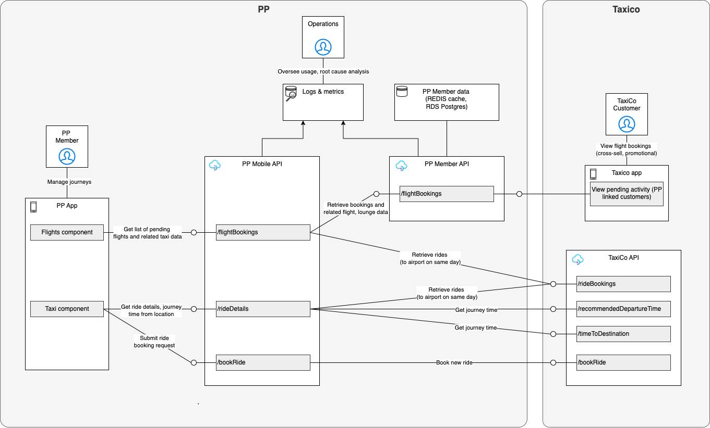
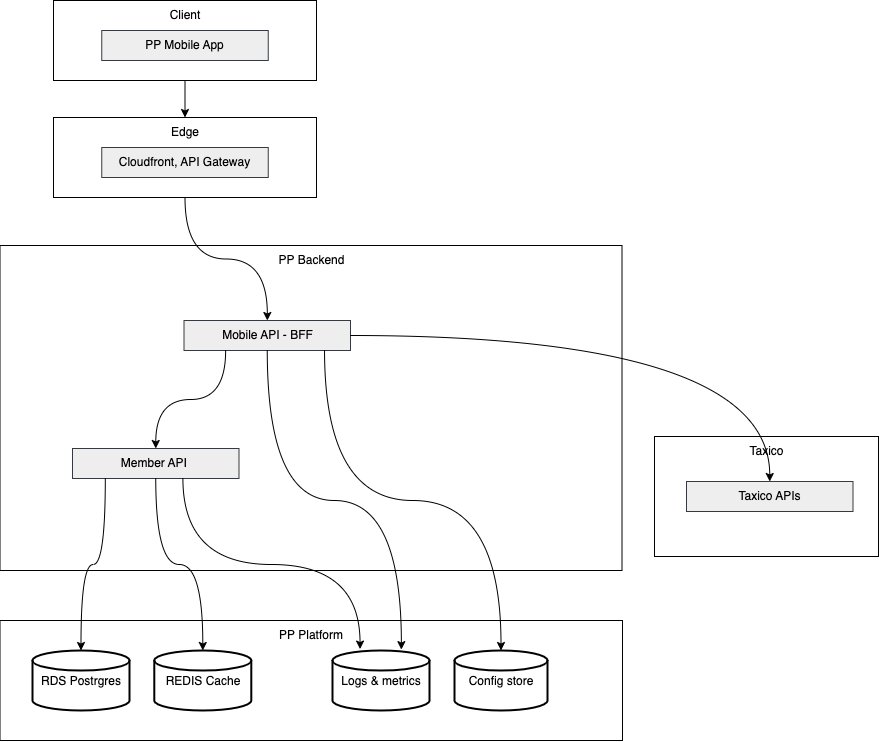
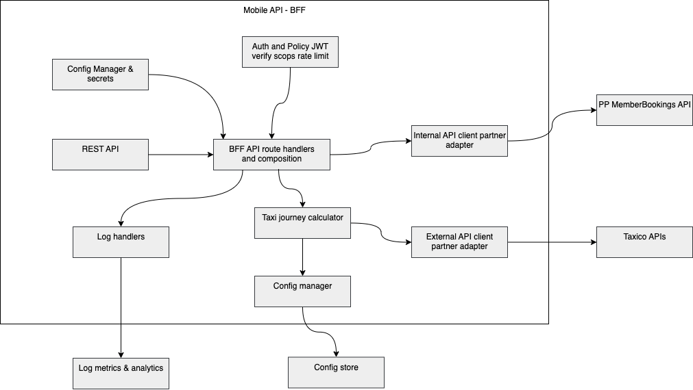

# PP Taxico Integration – Unified Airport Journey Service

**Goal:** Help members get to the airport on time by showing **time-to-destination** and a **recommended departure (pickup) time** based on flight details, terminal drop-off, and configurable buffers. Deliver a clear architecture, prototype-ready APIs, and a safe data model.

---

## Architecture Overview

### Architectural Principles
- **Simplicity**: Start with the simplest model that meets requirements. Avoid over-engineering.
- **Single front door**: A Backend-for-Frontend (BFF) encapsulates all partner calls, buffering logic, and error handling.
- **Resilience**: Use caching, timeouts, and retries to handle transient failures gracefully.
- **Data integrity**: Use a relational database (Postgres) for strong consistency and time math.
- **Security first**: Follow best practices for auth, least privilege, and PCI compliance.
- **Observability**: Correlated tracing, metrics, and structured logs for end-to-end visibility.
- **Extensibility**: Design for future growth (more partners, ML models, offline support) without major rewrites.
- **Cost-conscious**: Balance performance and reliability with cost-effective choices.

### Design decisions

| Area                                  | Decision                                                                      | Rationale                                                                                            | Implications (Now)                                                  | Implications (Later)                                                                  |
|---------------------------------------|-------------------------------------------------------------------------------|------------------------------------------------------------------------------------------------------|---------------------------------------------------------------------|---------------------------------------------------------------------------------------|
| **Mongo vs Postgres**                 | **Postgres** (optionally PostGIS later)                                       | Strong relational model (members ↔ flights ↔ terminals), FK integrity, time math with `INTERVAL`     | Reliable joins and constraints; straightforward analytics           | Add PostGIS for geo queries; materialized views for “next flight”                     |
| **Integration model (sync vs async)** | Synchronous REST only (webhooks/events later if needed)                       | Simple, predictable request/response; fastest to implement ; easy auth                               | PP depends on Taxico latency/uptime; may need polling for ride state; no push updates | Add webhooks for ride/ETA updates; event-driven cache invalidation; lower latency & load |
| **API orchestration**                 | **BFF orchestrates** all partner calls                                        | Centralizes buffer policy, member/terminal lookups, error handling                                        | Simpler mobile app; BFF manages timeouts/retries; consistent errors | Introduce lightweight workflow/state or sagas if flows grow (multi-step compensation) |
| **Authentication**                    | App→BFF: **OAuth2 Bearer JWT**; BFF→Taxico: **API key or client-credentials** | Standard patterns; easy rotation                                                                     | Clear scope boundaries; simple secret mgmt                          | Add **mTLS** and signed requests for higher assurance                                 |
| **Deployment**                        | Containers on managed compute + RDS                                           | Balanced cost/simplicity; portable                                                                   | Quick infra spin-up, predictable scaling                            | Serverless or k8s; multi-region failover if SLAs demand                               |

### Assumptions
| Assumption                            | Details                                                                                                      |
|---------------------------------------|--------------------------------------------------------------------------------------------------------------|
| **Journey time calculation**          | Taxico provides accurate ETAs and recommended pickup times based on live traffic and routing.                |
| **Member to Taxico customer linking** | Assumption that Taxico members have been linked to PP members already (partner customer_id in member table). |

### C4 diagrams
#### System Context

#### Container

#### Component and T-shirt sizing

| Module                                                          | T-shirt Size | Rationale                                                                                                                                      |
|-----------------------------------------------------------------|--------------|------------------------------------------------------------------------------------------------------------------------------------------------|
| **REST API**                                                    | **M**        | Needs routing, input validation, response formatting, error model. Standard framework scaffolding but non-trivial.                             |
| **Auth & Policy (JWT verify, scopes, rate limit)**              | **M**        | Requires JWT validation, claims parsing, rate limiting, integration with config/secrets. Complexity grows if multi-tenant.                     |
| **BFF API route handlers & composition**                        | **L**        | Central orchestration layer: composes calls to Member API + Taxico API, applies buffers, error handling, caching. Most custom logic lives here. |
| **Internal API client partner adapter (PP MemberBookings API)** | **S**        | Straightforward client to an internal API with known schema and low variability.                                                               |
| **External API client partner adapter (Taxico APIs)**           | **M**        | External dependency; must handle retries, timeouts, error mapping, schema drift. Higher resilience requirements.                               |
| **Taxi journey calculator**                                     | **M**        | Lightweight logic (buffer application, time arithmetic). Grows only if predictive models added.                                                |
| **Config Manager & secrets**                                    | **S**        | Uses cloud secrets manager + config store. Mostly wiring and secure access.                                                                    |
| **Log handlers**                                                | **S**        | Standardized logging with request correlation. Slightly more if structured logs and masking required.                                          |

### Data model

- **airports(id, name, code)**
- **terminals(id, airport_id → airports.id, name, code, dropoff_lat/long, transit_time_from_dropoff_to_gate)**
- **members(id, fname, lname, taxiCo_customer_id, taxiCo_customer_link_status, taxiCo_customer_link_time)**
- **flights(id, code, departure_airport → airports.id, departure_terminal → terminals.id, arrival_airport → airports.id, scheduled_departure, estimated_departure, status)**
- **bookings(id, member_id → members.id, flight_id → flights.id)**
- **lounges(id, terminal_id → terminals.id, …)**
- **config(id, buffer_time_transit)**

> Highly relational lookups (member → next flight → terminal → drop-off coords → buffer math). 
> Postgres gives FK integrity, INTERVAL arithmetic, and optional PostGIS later.

### Domains & APIs

- **PP BFF (Backend-for-Frontend)**
    - Public surface consumed by the PP app.
    - Endpoints:
        - `GET /bookingsList` → **proxy** to PP Member API `/flightBookings`.
        - `GET /rideDetails` → calls PP Member API for member/terminal context, calls Taxico `/recommendedDepartureTime`, **adds PP buffer**, returns `departureTime`.
        - `POST /bookRide` → **proxy** to Taxico `/bookRide`.
- **PP Member API**
    - Member-scoped data (no business logic leakage).
    - Endpoints:
        - `GET /flightBookings?memberId=...`
        - `GET /flightBookings/taxiCoClient?taxiCoCustomerId=...` (partner pull, row-level guarded).
- **Taxico API** (partner)
    - Journey math & ride ops owned by the taxi provider.
        - `GET /recommendedDepartureTime` (compute pickup to **arrive by** `arrivalTime`)
        - `GET /timeToDestination` (compute seconds for given `departureTime`)
        - `POST /bookRide`
        - `GET /rideBookings`

### Request Flow (happy path)

1. **PP App** calls **PP BFF** `/rideDetails` with `memberId`, `terminalId`, and start/destination coords + `arrivalTime`.
2. **PP BFF** reads **buffer** and validates `terminalId` (PP Member API or DB).
3. **PP BFF** calls **Taxico** `/recommendedDepartureTime` to get **raw pickup**.
4. **PP BFF** **applies PP buffer** (business-configurable) and returns **buffer-inclusive `departureTime`**.
5. Bookings and ride checks are proxied through the BFF to keep a single front door.

### Security & AuthN/Z

- **PP BFF**: OAuth2 **Bearer JWT** from the PP app; scopes like `journey:read`, `ride:book`.
- **PP Member API**: OAuth2 (service-to-service from BFF), row-level authorization by `memberId`.
- **Taxico API**: API key (or OAuth client-credentials). BFF is the sole client.
- **Partner correlation**: `members.taxiCo_customer_id` (or better, a PP-issued `partner_user_ref`) set only after **consentful linking**.

### Observability

- Correlated **`X-Request-Id`** across BFF ↔ Member API ↔ Taxico.
- Metrics: request latency, success/error rates, recommendation lead time, buffer deltas.
- Structured logs with key fields: `memberId`, `terminalId`, `arrivalTime`, `departureTime`.

---

## PCI Compliance (brief)

- **Out of scope for PAN**: All **payments are executed in Taxico** (deep link or hosted page). The PP platform **never handles card numbers**.
- **Data minimization**: PP shares only itinerary fields required for journey timing (no unnecessary PII).
- **Controls**: TLS 1.2+, strong auth, least-privilege tokens, audit logs, secrets in a managed vault.
- **If PP later takes payment**: use **tokenization/hosted fields** from a PCI-compliant PSP; keep PAN out of PP systems; align with SAQ-A/SAQ-A-EP depending on embed.

---

## Omissions & Trade-offs

| Item                                   | Decision  | Why / Shortcut                                 | Later / Fix                                                                       |
|----------------------------------------|-----------|------------------------------------------------|-----------------------------------------------------------------------------------|
| Partial offline support                | Skipped   | Journey timing relies on live data.            | Cache last known ETAs and conservative fallbacks.                                 |
| Buffers applied in BFF                 | Shortcut  | BFF adds a single `config.buffer_time_transit`. | Per-airport/terminal buffers; member-level preference; A/B testing.               |
| Direct latitude/longitude usage        | Shortcut  | Store drop-off as numeric lat/lon.             | Enable PostGIS and index on `GEOGRAPHY(Point)`; add proximity and geofencing.     |
| No webhook inbox                       | Shortcut  | Poll Taxico for ride bookings.                 | Signed webhooks (`BookingUpdated`, `ETAChanged`), idempotency, dead-letter queue. |
| No rate limiting/backoff policy in spec | Shortcut  | Omitted for brevity.                           | Per-route rate limits; 429 handling with `Retry-After`; exponential backoff.      |
| Basic error model                      | Shortcut  | Minimal `400/401/403/404/422/500`.             | Typed errors with codes; client guidance; SLO-driven retries.                     |

